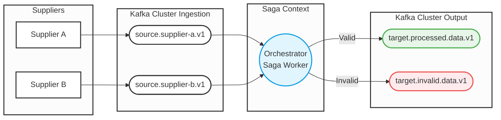

# Orquestrador de Múltiplos Fornecedores

## 📋 Introdução

Este projeto é uma API desenvolvida em .NET responsável por orquestrar a ingestão de dados de múltiplos fornecedores. O sistema consome eventos de infrações a partir de tópicos Kafka específicos por fornecedor, valida os dados recebidos através de State Machines (Saga Pattern via MassTransit), e publica o resultado em tópicos de saída — separando eventos válidos de inválidos. O estado das sagas é persistido no MongoDB.

---

## 📐 Pré-requisitos

- [.NET 10 SDK](https://dotnet.microsoft.com/download)
- [Docker](https://www.docker.com/) e Docker Compose

---

## 🗂️ Estrutura do Projeto

```
├── src/
│   └── Supplier.Ingestion.Orchestrator.Api/
│       ├── Extensions/                         # Configuração modular (MassTransit, OpenTelemetry, Health Checks)
│       ├── Infrastructure/
│       │   ├── Events/                         # Eventos de integração (UUID v5 determinístico)
│       │   ├── HealthChecks/                   # Health checks (MongoDB, Kafka)
│       │   └── StateMachines/                  # State Machines das sagas por fornecedor
│       └── Validators/                         # Validação de infrações (regras de negócio + IA)
├── tests/
│   └── Supplier.Ingestion.Orchestrator.Tests/
│       ├── UnitTests/                          # Testes unitários (validators, health checks, events)
│       ├── FunctionalTests/                    # Testes BDD com Reqnroll (Gherkin)
│       ├── IntegrationTests/                   # Testes de integração com Testcontainers
│       └── LoadTests/                          # Testes de carga com NBomber
├── deploy/                                     # Arquivos para deploy em produção/CI-CD
│   ├── docker-compose.yml                      # Orquestração completa via Docker Compose
│   ├── docker-compose.override.yml             # Overrides para ambiente local
│   └── files/                                  # Configs de infra (Grafana, Prometheus, OTel, etc.)
└── src/
    └── Supplier.Ingestion.Orchestrator.AppHost/ # Orquestrador .NET Aspire (desenvolvimento local)
```

---

## 🛠️ Tecnologias Utilizadas

| Tecnologia | Finalidade |
|---|---|
| **.NET 10** | Plataforma principal da API |
| **MassTransit** | Orquestração de sagas (Saga Pattern) |
| **Apache Kafka** | Broker de mensageria (entrada e saída de eventos) |
| **MongoDB** | Persistência do estado das sagas |
| **Anthropic Claude API** | Validação inteligente de infrações via IA |
| **OpenTelemetry** | Coleta de métricas, traces e logs |
| **Grafana / Loki / Tempo / Prometheus** | Observabilidade (dashboards, logs, traces, métricas) |
| **Scalar** | Documentação interativa da API (substitui Swagger UI) |
| **.NET Aspire** | Orquestração do ambiente local (AppHost) |
| **Docker Compose** | Deploy em produção/CI-CD |

---

## ✨ Funcionalidades Recentes

### 🤖 Validação de Infrações com IA (Claude API)

O sistema utiliza a API da Anthropic (Claude) para realizar uma segunda camada de validação inteligente das infrações recebidas. Após a validação básica de regras de negócio, a IA analisa:

- **Formato da placa**: padrão antigo (AAA-9999) ou Mercosul (AAA9A99)
- **Código CTB**: faixa válida entre 500 e 999
- **Valor da multa**: compatibilidade com a gravidade da infração
- **Inconsistências**: detecção de padrões suspeitos entre campos

A resposta da IA inclui: `isValid`, `isSuspicious`, `analysis` e `confidence`. Caso a IA identifique dados suspeitos ou inválidos, a infração é rejeitada automaticamente.

### 🔑 Correlation ID com UUID v5

O sistema substituiu a geração de IDs baseada em MD5 por **UUID v5 (RFC 4122)**, que utiliza SHA-1 com namespace DNS para gerar GUIDs determinísticos. Isso garante:

- **Determinismo**: o mesmo código externo sempre gera o mesmo CorrelationId
- **Rastreabilidade**: eventos com o mesmo ID externo se correlacionam automaticamente
- **Sem consultas ao banco**: IDs podem ser computados sem acesso ao banco de dados

### 🏥 Health Checks (MongoDB e Kafka)

Endpoints de saúde da aplicação para integração com orquestradores (Kubernetes, Docker, etc.):

| Endpoint | Finalidade |
|---|---|
| `/health` | Status geral da aplicação |
| `/health/ready` | Readiness probe — verifica MongoDB e Kafka |
| `/health/live` | Liveness probe — sempre retorna saudável |

- **MongoDB**: executa comando `ping` no banco admin
- **Kafka**: consulta metadados dos brokers via AdminClient (timeout de 5s)

### 🧪 Testes Funcionais BDD (Reqnroll)

Nova camada de testes usando **Reqnroll** (Gherkin/BDD) que cobre cenários de ponta a ponta:

- Validação de infrações (placa vazia, valor negativo, código externo ausente, múltiplos erros)
- Fluxo completo das state machines (infração válida → evento processado, infração inválida → evento de falha)
- Uso do MassTransit Test Harness com dependências mockadas

```gherkin
Scenario: Infração válida do Fornecedor A é finalizada com sucesso
  Given uma infração válida do fornecedor A
  When a saga do fornecedor A processa o evento
  Then a saga deve ser finalizada
  And um evento unificado deve ser produzido
```

### 🧩 Refatoração em Extensions

A configuração da aplicação foi modularizada em extension methods organizados:

| Extension | Responsabilidade |
|---|---|
| `MassTransitExtensions` | Sagas, MongoDB, Kafka riders (tópicos de entrada e saída) |
| `OpenTelemetryExtensions` | Métricas, traces e logs via OTLP |
| `HealthCheckExtensions` | Health checks de MongoDB e Kafka |
| `ApplicationExtensions` | Middleware pipeline (OpenAPI, Scalar, health endpoints) |

---

## 🔀 Fluxo de Dados



### Tópicos Kafka

| Tópico | Direção | Descrição |
|---|---|---|
| `source.supplier-a.v1` | Entrada | Eventos do Fornecedor A |
| `source.supplier-b.v1` | Entrada | Eventos do Fornecedor B |
| `target.processed.data.v1` | Saída | Eventos validados com sucesso |
| `target.invalid.data.v1` | Saída | Eventos com falha de validação |

---

## 🧪 Bibliotecas de Teste

| Biblioteca | Finalidade |
|---|---|
| **xUnit** | Framework de testes |
| **Reqnroll** | Testes funcionais BDD (Gherkin) |
| **AutoFixture / AutoFixture.AutoMoq** | Geração de dados de teste e mocks automáticos |
| **FluentAssertions** | Asserções legíveis e expressivas |
| **Testcontainers.Kafka** | Testes de integração com Kafka real via container |
| **NBomber** | Testes de carga e performance |

---

## ▶️ Como Executar

### Via .NET Aspire (recomendado para desenvolvimento)

Sobe toda a infraestrutura (Kafka, MongoDB) e a API de forma orquestrada, com dashboard de observabilidade:

```bash
dotnet run --project src/Supplier.Ingestion.Orchestrator.AppHost
```

### Via Docker Compose (produção / CI-CD)

Sobe toda a infraestrutura (Kafka, MongoDB, Grafana, Prometheus, etc.) junto com a API:

```bash
docker-compose -f deploy/docker-compose.yml up -d
```

Apenas infraestrutura (sem a API):

```bash
docker-compose -f deploy/files/docker-compose.yml up -d
```

### Executar Testes

```bash
dotnet test
```

---

## 🌐 Portas dos Serviços

| Serviço | URL |
|---|---|
| API | http://localhost:8080 |
| Scalar (API Docs) | http://localhost:8080/scalar/v1 |
| Health Check | http://localhost:8080/health |
| Kafka UI | http://localhost:8090 |
| Mongo Express | http://localhost:8181 |
| Grafana | http://localhost:3000 |
| Prometheus | http://localhost:9090 |

---

## 🕹️ Exemplos de Eventos

### Fornecedor A

**Evento válido**
```json
{
  "ExternalCode": "TESTE-FIXO-HASH",
  "Plate": "ABC-1234",
  "Infringement": 7455,
  "TotalValue": 100.00,
  "OriginSystem": "Fornecedor_A"
}
```
Destino: `target.processed.data.v1`

**Evento inválido**
```json
{
  "ExternalCode": "TESTE-FIXO-HASH",
  "Plate": "ABC-1234",
  "Infringement": 7455,
  "TotalValue": -100.00,
  "OriginSystem": "Fornecedor_A"
}
```
Destino: `target.invalid.data.v1`

---

### Fornecedor B

**Evento válido**
```json
{
  "ExternalCode": "PEDIDO-B-FINAL-900",
  "Plate": "BBB-8888",
  "Infringement": 6050,
  "TotalValue": 355.50,
  "OriginSystem": "Fornecedor_B"
}
```
Destino: `target.processed.data.v1`

**Evento inválido**
```json
{
  "ExternalCode": "PEDIDO-B-FINAL-900",
  "Plate": "BBB-8888",
  "Infringement": 6050,
  "TotalValue": -355.50,
  "OriginSystem": "Fornecedor_B"
}
```
Destino: `target.invalid.data.v1`
