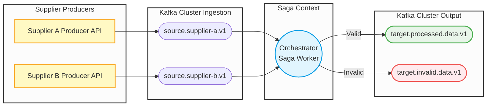

# Orquestrador de Múltiplos Fornecedores

## 📋 Introdução

Este projeto implementa um sistema completo de ingestão e orquestração de dados de múltiplos fornecedores. O ecossistema é composto por três APIs:

- **Supplier A Producer** — simula o sistema legado do Fornecedor A, publicando infrações no tópico Kafka `source.supplier-a.v1`
- **Supplier B Producer** — simula o sistema legado do Fornecedor B, publicando infrações no tópico Kafka `source.supplier-b.v1`
- **Orchestrator API** — consome os tópicos de entrada, valida os dados via State Machines (Saga Pattern), e publica o resultado nos tópicos de saída

O estado das sagas é persistido no MongoDB. A validação combina regras de negócio com análise inteligente via Claude API (Anthropic).

---

## 📐 Pré-requisitos

- [.NET 10 SDK](https://dotnet.microsoft.com/download)
- [Docker](https://www.docker.com/) (engine — o Aspire gerencia os containers automaticamente em desenvolvimento)
- Docker Compose (apenas para deploy em produção/CI-CD)
- Chave de API da Anthropic (`ANTHROPIC_API_KEY`)

---

## 🗂️ Estrutura do Projeto

```
├── src/
│   ├── Supplier.A.Producer.Api/                  # API produtora do Fornecedor A
│   │   └── Properties/launchSettings.json
│   ├── Supplier.B.Producer.Api/                  # API produtora do Fornecedor B
│   │   └── Properties/launchSettings.json
│   ├── Supplier.Ingestion.Orchestrator.Api/
│   │   ├── Extensions/                           # Configuração modular (MassTransit, Health Checks)
│   │   ├── Infrastructure/
│   │   │   ├── Consumers/                        # Consumer da DLQ
│   │   │   ├── Events/                           # Eventos de integração (UUID v5 determinístico)
│   │   │   ├── HealthChecks/                     # Health checks (MongoDB, Kafka)
│   │   │   ├── Repositories/                     # Repositório de infrações inválidas
│   │   │   └── StateMachines/                    # State Machines das sagas por fornecedor
│   │   └── Validators/                           # Validação de infrações (regras de negócio + IA)
│   ├── Supplier.Ingestion.Orchestrator.AppHost/  # Orquestrador .NET Aspire (desenvolvimento local)
│   └── Supplier.Ingestion.Orchestrator.ServiceDefaults/ # Configurações compartilhadas (OTel, health, resilience)
├── tests/
│   └── Supplier.Ingestion.Orchestrator.Tests/
│       ├── UnitTests/                            # Testes unitários (validators, health checks, events)
│       ├── FunctionalTests/                      # Testes BDD com Reqnroll (Gherkin)
│       ├── IntegrationTests/                     # Testes de integração com Testcontainers
│       └── LoadTests/                            # Testes de carga com NBomber
└── deploy/                                       # Arquivos para deploy em produção/CI-CD
    ├── docker-compose.yml                        # Orquestração completa via Docker Compose
    ├── docker-compose.override.yml               # Overrides para ambiente local
    └── files/                                    # Configs de infra (Grafana, Prometheus, OTel, etc.)
```

---

## 🛠️ Tecnologias Utilizadas

| Tecnologia | Finalidade |
|---|---|
| **.NET 10** | Plataforma principal |
| **MassTransit** | Orquestração de sagas (Saga Pattern) e Kafka riders |
| **Apache Kafka** | Broker de mensageria (entrada e saída de eventos) |
| **MongoDB** | Persistência do estado das sagas |
| **Anthropic Claude API** | Validação inteligente de infrações via IA |
| **OpenTelemetry** | Coleta de métricas, traces e logs |
| **Grafana / Loki / Tempo / Prometheus** | Observabilidade (dashboards, logs, traces, métricas) |
| **Scalar** | Documentação interativa da API (substitui Swagger UI) |
| **.NET Aspire** | Orquestração do ambiente local (AppHost + ServiceDefaults) |
| **Docker Compose** | Deploy em produção/CI-CD |
| **Confluent.Kafka** | Producer Kafka nativo nas APIs dos fornecedores |

---

## ✨ Funcionalidades

### 🏭 Simulação de Fornecedores (Supplier A e B Producers)

Cada fornecedor expõe uma API Minimal API com dois endpoints de publicação:

- `POST /infringements` — publica uma infração específica com dados informados
- `POST /infringements/simulate?count=N` — gera e publica até 100 infrações com dados aleatórios válidos (placas no formato antigo AAA-9999 ou Mercosul AAA9A99)

Ambos os produtores computam o `CorrelationId` via **UUID v5** (mesmo algoritmo do orquestrador), garantindo idempotência ponta a ponta.

### 🤖 Validação de Infrações com IA (Claude API)

O sistema utiliza a API da Anthropic (Claude) para realizar uma segunda camada de validação inteligente das infrações recebidas. Após a validação básica de regras de negócio, a IA analisa:

- **Formato da placa**: padrão antigo (AAA-9999) ou Mercosul (AAA9A99)
- **Código CTB**: faixa válida entre 500 e 999
- **Valor da multa**: compatibilidade com a gravidade da infração
- **Inconsistências**: detecção de padrões suspeitos entre campos

A resposta da IA inclui: `isValid`, `isSuspicious`, `analysis` e `confidence`. Caso a IA identifique dados suspeitos ou inválidos, a infração é rejeitada automaticamente.

### 🔑 Correlation ID com UUID v5

O sistema utiliza **UUID v5 (RFC 4122)** com SHA-1 e namespace DNS para gerar GUIDs determinísticos. Isso garante:

- **Determinismo**: o mesmo código externo sempre gera o mesmo CorrelationId
- **Rastreabilidade**: eventos com o mesmo ID externo se correlacionam automaticamente
- **Sem consultas ao banco**: IDs podem ser computados sem acesso ao banco de dados
- **Idempotência ponta a ponta**: produtores e orquestrador usam o mesmo algoritmo

### 🔁 DLQ com Reprocessamento

Infrações inválidas são armazenadas no MongoDB e disponibilizadas via API:

| Endpoint | Método | Descrição |
|---|---|---|
| `/dlq` | `GET` | Lista as últimas 50 infrações inválidas |
| `/dlq/{id}/retry` | `POST` | Reprocessa uma infração pelo ID, republicando no tópico de origem |

### 🏥 Health Checks (MongoDB e Kafka)

| Endpoint | Finalidade |
|---|---|
| `/health` | Status geral da aplicação |
| `/health/ready` | Readiness probe — verifica MongoDB e Kafka |
| `/health/live` | Liveness probe — sempre retorna saudável |

### 🧪 Testes Funcionais BDD (Reqnroll)

Camada de testes usando **Reqnroll** (Gherkin/BDD) que cobre cenários de ponta a ponta:

```gherkin
Scenario: Infração válida do Fornecedor A é finalizada com sucesso
  Given uma infração válida do fornecedor A
  When a saga do fornecedor A processa o evento
  Then a saga deve ser finalizada
  And um evento unificado deve ser produzido
```

### 🧩 Configuração Modular em Extensions

| Extension | Responsabilidade |
|---|---|
| `MassTransitExtensions` | Sagas, MongoDB, Kafka riders (tópicos de entrada e saída) |
| `HealthCheckExtensions` | Health checks de MongoDB e Kafka |
| `ApplicationExtensions` | Middleware pipeline (OpenAPI, Scalar, health endpoints) |
| `ServiceDefaults` | OTel (métricas, traces, logs), service discovery e resilience via Aspire |

---

## 🔀 Fluxo de Dados



### Tópicos Kafka

| Tópico | Direção | Publisher | Descrição |
|---|---|---|---|
| `source.supplier-a.v1` | Entrada | Supplier A Producer | Eventos do Fornecedor A |
| `source.supplier-b.v1` | Entrada | Supplier B Producer | Eventos do Fornecedor B |
| `target.processed.data.v1` | Saída | Orchestrator | Eventos validados com sucesso |
| `target.invalid.data.v1` | Saída | Orchestrator | Eventos com falha de validação |

---

## ▶️ Como Executar

### Via .NET Aspire (recomendado para desenvolvimento)

Configure a chave da API Anthropic via User Secrets (uma única vez):

```bash
dotnet user-secrets set "Anthropic:ApiKey" "sk-ant-..." --project src/Supplier.Ingestion.Orchestrator.Api
```

Suba toda a infraestrutura e as três APIs:

```bash
dotnet run --project src/Supplier.Ingestion.Orchestrator.AppHost
```

A URL do **Aspire Dashboard** é exibida no terminal ao iniciar. Os três serviços e seus links diretos para o Scalar ficam disponíveis no dashboard — as portas são alocadas dinamicamente.

### Via Docker Compose (produção / CI-CD)

```bash
cd deploy
cp .env.example .env
# Edite .env e preencha ANTHROPIC_API_KEY, MONGO_ROOT_PASSWORD, etc.
docker compose up --build
```

### Executar Testes

```bash
dotnet test
```

---

## 🌐 Portas e Serviços

### Via .NET Aspire (desenvolvimento)

As portas são **alocadas dinamicamente**. Acesse o **Aspire Dashboard** (URL exibida no terminal) para os links de cada serviço.

| Serviço | Porta padrão | Scalar UI |
|---|---|---|
| Aspire Dashboard | `https://localhost:15888` | — |
| Orchestrator API | dinâmica | `<url>/scalar/v1` |
| Supplier A Producer | `http://localhost:5001` | `http://localhost:5001/scalar/v1` |
| Supplier B Producer | `http://localhost:5002` | `http://localhost:5002/scalar/v1` |
| Kafka UI | dinâmica | — |
| Mongo Express | dinâmica | — |

### Via Docker Compose (produção / CI-CD)

| Serviço | URL |
|---|---|
| Orchestrator API | http://localhost:8080 |
| Supplier A Producer | http://localhost:8082 |
| Supplier B Producer | http://localhost:8083 |
| Scalar (Orchestrator) | http://localhost:8080/scalar/v1 |
| Scalar (Supplier A) | http://localhost:8082/scalar/v1 |
| Scalar (Supplier B) | http://localhost:8083/scalar/v1 |
| Health Check | http://localhost:8080/health |
| Kafka UI | http://localhost:8090 |
| Mongo Express | http://localhost:8181 |
| Grafana | http://localhost:3000 |
| Prometheus | http://localhost:9090 |
| Loki | http://localhost:3100 |
| Tempo | http://localhost:3200 |

---

## 🕹️ Testando o Fluxo Completo

### 1. Publicar infrações

```bash
# Simular 5 infrações aleatórias do Fornecedor A
curl -X POST "http://localhost:5001/infringements/simulate?count=5"

# Simular 5 infrações aleatórias do Fornecedor B
curl -X POST "http://localhost:5002/infringements/simulate?count=5"

# Publicar infração específica do Fornecedor A
curl -X POST http://localhost:5001/infringements \
  -H "Content-Type: application/json" \
  -d '{"externalCode":"TESTE-001","plate":"ABC-1234","infringement":511,"totalValue":195.23}'
```

### 2. Acompanhar o processamento

| Interface | URL | O que ver |
|---|---|---|
| Aspire Dashboard | `https://localhost:15888` | Traces, logs, métricas |
| Kafka UI | dinâmica (dashboard) | Mensagens nos tópicos |
| Mongo Express | dinâmica (dashboard) | Estado das sagas |

### 3. Consultar e reprocessar falhas (DLQ)

```bash
# Listar infrações inválidas
curl http://localhost:8080/dlq

# Reprocessar por ID
curl -X POST http://localhost:8080/dlq/{id}/retry
```

---

## 🧪 Bibliotecas de Teste

| Biblioteca | Finalidade |
|---|---|
| **xUnit** | Framework de testes |
| **Reqnroll** | Testes funcionais BDD (Gherkin) |
| **AutoFixture / AutoFixture.AutoMoq** | Geração de dados de teste e mocks automáticos |
| **FluentAssertions** | Asserções legíveis e expressivas |
| **Testcontainers.Kafka** | Testes de integração com Kafka real via container |
| **NBomber** | Testes de carga e performance |
